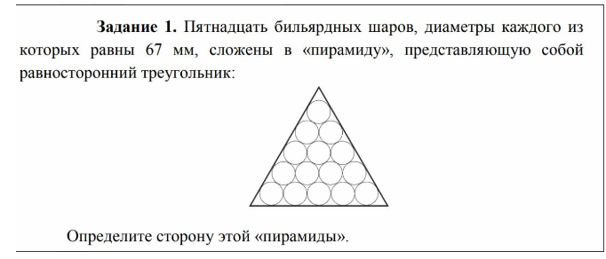
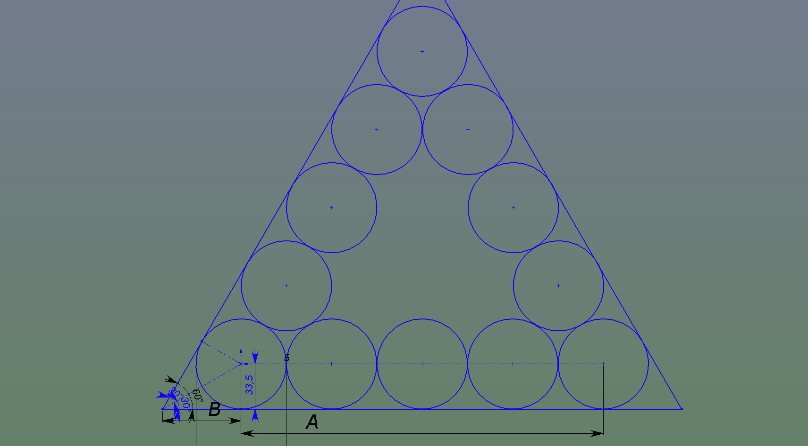
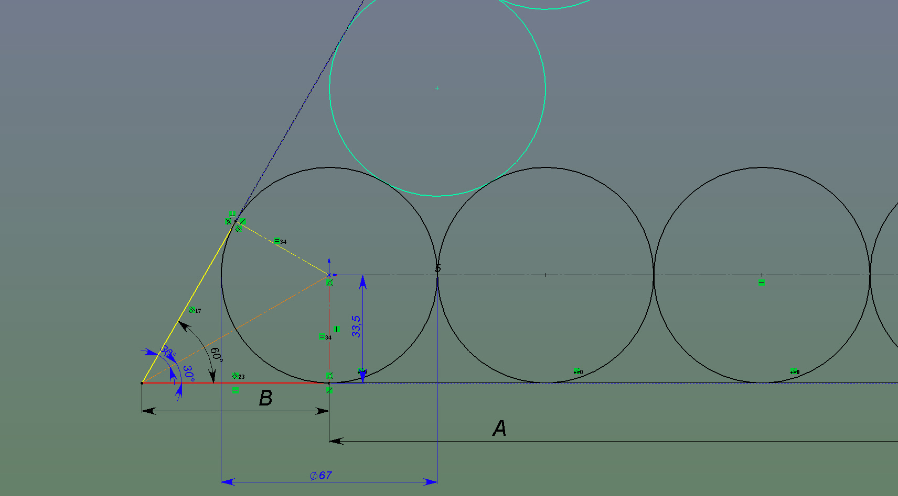

# Задача


# Решение
<!--  -->



1. D/R - диаметр/радиус шара. Сторона треугольника представляет собой А + 2 * В. Поскольку сторона касательна окружностям радиусы перпендикулярны стороне, следовательно А - это сторона прямоугольника равная 3 * D + 2 * R = 4 * D.
2. Жёлтый и красный прямоугольные треугольники равны, поскольку у них общий большой катет, а маленькие равны R, то есть равны между собой. Значит общий катет является биссектрисой угла основного треугольника, а угол в красном треугольнике равен 30 градусам. Котангенс такого угла равен sqrt(3), тогда B = sqrt(3) * R.
3. Итого (4 * D) + (sqrt(3) * R * 2) = 384.04740410711474 мм

## Example:
```js
d = 67
67
> (Math.sqrt(3) * d) + (4 * d)
384.04740410711474
```