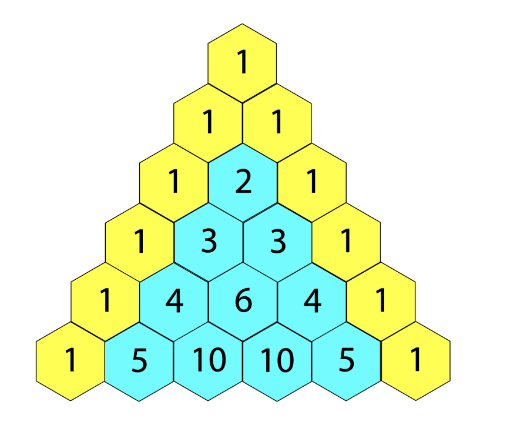

### Pascal triangle

Pascal's triangle is an infinite table of binomial coefficients that has a triangular shape. In this triangle there are ones on the top and on the sides. Each number is equal to the sum of two numbers above it. The lines of the triangle are symmetric about the vertical axis.

<!--  -->


Write a function that returns the specified Pascal triangle string as an array. Export the default function.

## Example:
```js
generate(1); // [1, 1]  
generate(4); // [1, 4, 6, 4, 1]
```